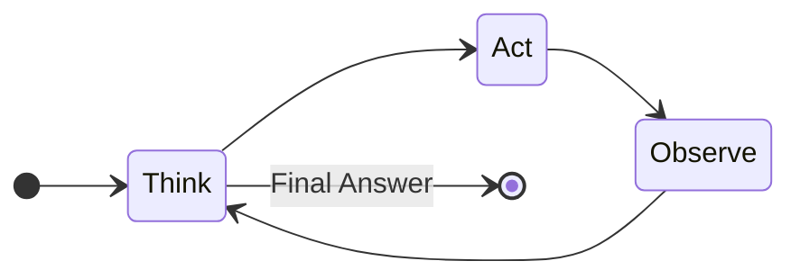
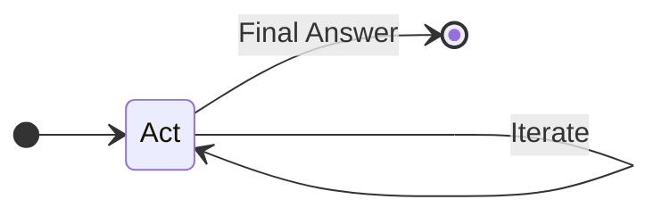

In the previous post, we mentioned that an agent harness is composed of all information provided to an agent to augment the agent's ability, and that in practice, this amounts to adding MCPs, skills, prompts, and more.

However, this definition is missing the reasoning component of AI agents. How do we turn an LLM (a powerful next-token predictor) into an AI agent? 
<!-- Let us first layout a few fundamental definitions and then go on to review the implementations of a few powerful open-source AI agents. -->

LLMs are next-token predictors that returns the next-token distribution given a set of context tokens $c_t$. After a new token is generated, there is a context update function $f$ which recursively updates the context $c_t$. In many systems, such as chatbots for example, the update function $f$ is simply list concatenation. 
$$$
x_t \sim p_{\theta}(c_{t-1}), \qquad c_t = f(c_{t-1}, x_t)
$$$

To turn LLM's into useful AI agents, we first consider the traditional POMDP / RL definition of agents. The idea is that at any time-step $t$, an agent looks at its environment $\mathcal{E}$ and gathers an observation $o_t$. Then, using a policy $\pi(a_t | o_t)$, the agent uses its current observation to decide which action $a_t$ to take. Then, the observation-action loop continues either indefinitely or until the agent has completed it's assignment. 
$$$
c_t = f(c_{t-1}, a_t) \\
a_t \in \{ \text{thought}, \text{action}, \text{observation} \}
$$$
So to generate the answer to the user prompt, the LLM performs multiple actions $a_t$ until it has decided on the final answer. For almost all mainstream AI agents, the policy $\pi(a_t | c_t)$ is implicitly restricted to a fixed state machine. For example, for the popular ReAct agent, the agent is system-prompted to repeat a sequential (Think -> Act -> Observe) loop. 



Given the immense popularity of tool-calling and reasoning / self-reflection, newly released LLM models have already been fine-tuned to perform reasoning and tool-calling, so simply exposing tools to newer LLMs is often sufficient to achieve the performance of (explicitly-prompted) ReAct agents. This is why many powerful AI agents today no longer follow the original ReAct framework (e.g. LangChain no longer recommends [`create_react_agent`](https://reference.langchain.com/python/langchain-classic/agents/react/agent/create_react_agent)). Instead, the Think and Observe phases, which were behaviors explicitly prompted in the ReAct framework, are now natively performed by the fine-tuned reasoning LLMs, resulting in a greatly simplified state machine:


Let's take a look at a few real-world implementations of AI agents.

## LangChain / LangGraph `create_agent`

The main [`create_agent`](https://github.com/langchain-ai/langchain/blob/master/libs/langchain_v1/langchain/agents/factory.py#L691) function in LangChain uses LangGraph under the hood, which is a programming library that defines AI-augmented workflows as state-based directed graphs. A global agent state is initialized at the starting node, and the agent state is iteratively updated as the agent traverses the graph. Transitions happen when a certain criterion is met, and the agent is terminated only when it reaches an end state. 

The main agent loop is where the LLM is programmed to decide what actions $a_t$ to take in order to accomplish the user prompt. 

The pseudo-code below is the simplified LangGraph AI agent code used within `create_agent`. 
```python

def create_agent():
    graph.add_node("model")
    graph.add_node("tools")

    # Middlewares
    graph.add_node("before_agent")
    graph.add_node("before_model")
    graph.add_node("after_agent")
    graph.add_node("after_model")

    graph.add_edge(START, "before_agent")
    graph.add_edge("before_agent", "before_model")
    graph.add_edge("before_model", "model")
    graph.add_edge("model", "after_model")
    graph.add_edge("after_model", "after_agent")
    graph.add_edge("after_agent", END)

    # Each middleware can potentially go to the tool node
    graph.add_conditional_edge("tools", "before_agent")
    graph.add_conditional_edge("before_agent", "tools")

    graph.add_conditional_edge("tools", "before_model")
    graph.add_conditional_edge("before_model", "tools")

    graph.add_conditional_edge("tools", "after_model")
    graph.add_conditional_edge("after_model", "tools")

    graph.add_conditional_edge("tools", "after_agent")
    graph.add_conditional_edge("after_agent", "tools")

    # The main model also has access to tools
    graph.add_conditional_edge("tools", "model")
    graph.add_conditional_edge("model", "tools")
    
```

## Middlewares for custom logic before and after the main agent loop

[Middlewares](https://docs.langchain.com/oss/python/langchain/middleware/overview) are an abstraction implemented in LangChain / LangGraph that allows the user to "customize agent behavior between steps in the main agent loop". In the LangChain `create_agent` function, there are generally four types of middlewares, called `before_agent`, `before_model`, `after_model`, and `after_agent`. Middlwares seem to introduce another piece to the (confusing) AI agent design puzzle, but in the source code, middlewares are actually just defined as functions that are also ran before or after the main agent loop. The middleware functions can also be LLM calls themselves, which may invoke tool calls. **Thus, we can think of middlewares as the pieces of code that engineer and process the inputs and outputs to the main agent loop.** [[Source Code](https://github.com/langchain-ai/langchain/blob/master/libs/langchain_v1/langchain/agents/middleware/types.py#L380)]

## MCPs and Agent Skills are tool abstractions

Model Context Protocol servers (MCPs) are simply agent tools that are developed and hosted by other developers. For the agent to know what tools are available, the agent can send an HTTPS query to the MCP server to get back a `.md` description of all the available tools. Then, when the LLM decides to call the MCP server tools with some LLM-determined parameters, the agent sends a JSON remote procedure calls (RPC) to execute the selected MCP server tool on the MCP server, and the result is sent back to the agent. 

Agent Skills are simply agent tools that are (usually) stored on the filesystem of the agent runtime computer. For the agent to know what tools are available, the agent is given the filesystem path to all the skills folders and queries each skills folder to get a `.md` description of all the available tools (this operation itself is a tool, called `load_skills` in LangChain). The tools here are often executable scripts (`.sh` or `.py` are common) that the LLM can run itself (e.g. when exposed with a `bash` tool). Then, when the LLM decides to which agent skills tools with some LLM-determined parameters, the agent executes the selected skill by usually calling the `bash` tool, and the result is sent back to the agent.
```
bash ./<path_to_skill_tool> --arg1 --arg2
```

## Memories augment LLM context

LangChain uses two main types of memory, short- and long-term. Short-term memories contain the entire context history of the agent and are stored in [Checkpoints](). For example, a chatbot's raw short-term memory contains the system prompt, raw agent responses (including reasoning traces and tool calls), and user responses. Alternatively, long-term memory is persistent information (e.g. `AGENTS.md`) that the agent decides to save in a [Store]() because it might be useful for the future. Examples include information about the user (e.g. preferences, background), past behavior that led to agent insights (episodic), and system prompts. 

How are memories used by the agent?

Short-term memory is often first processed from its raw (saved) format and then loaded into the LLM context window.

Long-term memory is retrieved during the main agent loop (or in system prompt?)

<!-- Tools vs Middleware (middleware are also just tools? not quite, they also take in the context / previous messages too (customize agent behavior
    between steps in the main agent loop from [langchain](https://github.com/langchain-ai/langchain/blob/master/libs/langchain_v1/langchain/agents/middleware/types.py#L380)). [summarization middleware](https://github.com/langchain-ai/langchain/blob/master/libs/langchain_v1/langchain/agents/middleware/summarization.py)) -->


# More open-source agent implementations

[deepagents Agent Loop](https://github.com/langchain-ai/deepagents/blob/main/libs/deepagents/deepagents/graph.py#L218) (`libs/deepagents/deepagents/graph.py`)

[OpenClaw Agent Loop](https://github.com/openclaw/openclaw/blob/main/src/agents/pi-embedded-runner/run.ts#L237) (`src/agents/pi-embedded-runner/run.ts`)

[OpenCode Agent Loop](https://github.com/anomalyco/opencode/blob/dev/packages/opencode/src/session/prompt.ts) (`packages/opencode/src/session/prompt.ts`)

---
TODO: make into interactive experience.